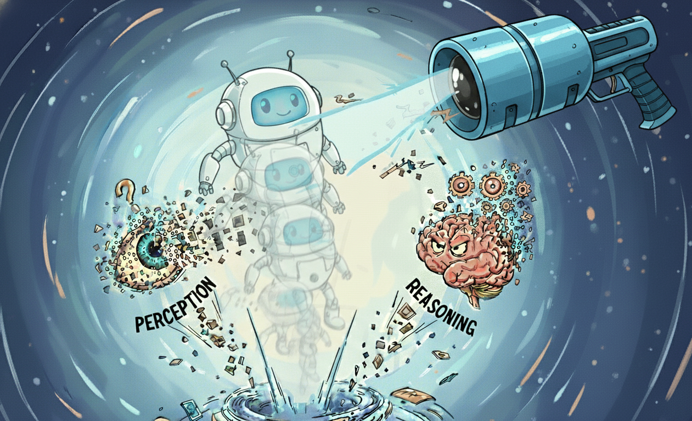
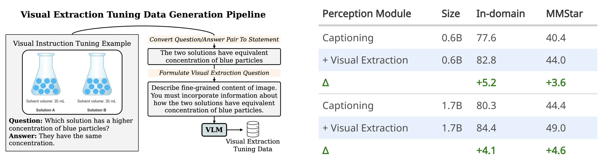

<p align="center">

  <h1 align="center"><i>Downscaling Intelligence</i>: Exploring Perception and Reasoning Bottlenecks in Small Multimodal Models <br>
    <a href='https://arxiv.org/abs/2511.17487'>
    
    </a>
    <a href='https://web.stanford.edu/~markendo/projects/downscaling_intelligence' style='padding-left: 0.5rem'>
    
    </a>
    <a href='https://huggingface.co/collections/markendo/extractthink' style='padding-left: 0.5rem;'>
    
    </a>
    <a href='https://huggingface.co/datasets/markendo/Visual-Extraction-Tuning-382K' style='padding-left: 0.5rem;'>
    
    </a>
  </h1>
  <h3 align="center">
    <a href="https://web.stanford.edu/~markendo/"><strong>Mark Endo</strong></a>
    ,
    <a href="https://ai.stanford.edu/~syyeung/"><strong>Serena Yeung-Levy</strong></a>
  </h3>
  <div align="center">
  </div>
</p>


<p align="center">

</p>


## Contents
- [Setup](#setup)
- [Extract+Think](#extract-think)
- [Visual Extraction Tuning Data Generation](#visual-extraction-tuning-data-generation)

## Setup


1. Clone the repository
```
git clone https://github.com/markendo/downscaling_intelligence
cd downscaling_intelligence
```

2. Install packages
```
conda create -n extract_think python=3.10 -y
conda activate extract_think
pip install -e .
```

3. Setup evaluation framework

We utilize [lmms-eval](https://github.com/EvolvingLMMs-Lab/lmms-eval) to evaluate our approach. As we follow a two-stage pipeline, we make customizations to the models and tasks. In order to simplify use in a standard setup, we include only the files that need to be added to the existing lmms-eval framework, rather than the entire modified repository. We test compatability on version [`lmms-eval-0.4`](https://github.com/EvolvingLMMs-Lab/lmms-eval/tree/ed6a095baf5181b5635f947ade9c1b7f48146830), but it should also be compatible with future versions.

```
git clone https://github.com/EvolvingLMMs-Lab/lmms-eval.git
cd lmms-eval
git checkout ed6a095baf5181b5635f947ade9c1b7f48146830
cd ..
```

Then, add the following files to their respective locations:
```
cp lmms_eval_custom_files/qwen3.py lmms-eval/lmms_eval/models/simple/
cp lmms_eval_custom_files/mmstar/{mmstar_prism_stage_1.yaml,mmstar_prism_stage_2.yaml,stage_1_utils.py,stage_2_utils.py} lmms-eval/lmms_eval/tasks/mmstar/
```

Lastly, add `"qwen3": "Qwen3",` to the `AVAILABLE_SIMPLE_MODELS` dictionary in `lmms-eval/lmms_eval/models/__init__.py`.

<h2 id="extract-think">Extract+Think</h2>

Here we provide checkpoints and sample evaluations for our models trained under the visual extraction tuning paradigm. For the reasoning stage, we utilize Qwen3 ([1.7B](https://huggingface.co/Qwen/Qwen3-1.7B) and [4B](https://huggingface.co/Qwen/Qwen3-4B)).

To evaluate on MMStar, first generate the extracted visual information:
```
cd lmms-eval
model_name=markendo/llava-extract-qwen3-1.7B
python -m lmms_eval \
    --model=llava_onevision \
    --model_args=pretrained=$model_name,conv_template=qwen_1_5,device_map=auto \
    --tasks=mmstar_prism_stage_1 \
    --batch_size=1 \
    --output_path results \
    --log_samples

```

Then, run second stage of reasoning (note you need to pass in the path of the saved outputs from the first stage):
```
stage_1_path=/path/to/stage_1/samples.jsonl
perception_model_size=1.7B
pretrained=Qwen/Qwen3-4B

enable_thinking=True
python -m lmms_eval \
    --model=qwen3 \
    --model_args="pretrained=${perception_model_size};${pretrained};${enable_thinking},stage_1_path=$stage_1_path" \
    --tasks=mmstar_prism_stage_2 \
    --batch_size=1 \
    --output_path results \
    --log_samples
```


| Model | LLM Size | # Vis. Data | In-Domain Avg. | MMStar Avg. |
|---|---|---|---|---|
| **End-to-End** | | | | |
| LLaVA-OneVision | 0.5B | 8.8M | 71.1 | 39.0 |
| InternVL2.5 | 0.5B | 64M | 83.2 | 48.2 |
| SmoLVLM | 1.7B | unk. | 75.9 | 41.3 |
| Our Baseline | 0.6B | 1.0M | 65.9 | 37.2 |
| Our Baseline | 1.7B | 1.0M | 76.8 | 40.9 |
| **Decoupled Models** | P / R| | | |
| PrismCaptioner | 1.8B / 70B | 1.9M | 75.4 | 41.9 |
| PrismCaptioner | 7.0B / 70B | 1.9M | 78.3 | 45.7 |
| Our Baseline | 0.6B / 4.0B | 1.0M | 64.6 | 34.0 |
| Our Baseline | 1.7B / 4.0B | 1.0M | 69.4 | 39.4 |
| <span style="font-variant: small-caps;">Caption+Think</span> | 0.6B / 1.7B | 2.0M | 75.0 | 43.0 |
| <span style="font-variant: small-caps;">Caption+Think</span> | 1.7B / 4.0B | 2.0M | 80.0 | 49.0 |
| [<span style="font-variant: small-caps;">Extract+Think</span><sup>†</sup>](https://huggingface.co/markendo/llava-extract-from-scratch-qwen3-0.6B) | 0.6B / 1.7B | 0.4M | 78.0 | 42.6 |
| [<span style="font-variant: small-caps;">Extract+Think</span><sup>†</sup>](https://huggingface.co/markendo/llava-extract-from-scratch-qwen3-1.7B) | 1.7B / 4.0B | 0.4M | 82.7 | 48.1 |
| [<span style="font-variant: small-caps;">Extract+Think</span>](https://huggingface.co/markendo/llava-extract-qwen3-0.6B) | 0.6B / 1.7B | 2.4M | 80.3 | 46.6 |
| [<span style="font-variant: small-caps;">Extract+Think</span>](https://huggingface.co/markendo/llava-extract-qwen3-1.7B) | 1.7B / 4.0B | 2.4M | 85.3 | 52.6 |

*For the full table, please refer to our paper.*

## Visual Extraction Tuning Data Generation

We provide the pipeline for generating visual extraction tuning data at [`visual_extraction_tuning_pipeline.py`](visual_extraction_tuning_pipeline.py)

<p align="center">
    
</p>

We also provide the 382K generated examples from the paper [here](https://huggingface.co/datasets/markendo/Visual-Extraction-Tuning-382K).

## Acknowledgments

This repository is built on top of [LLaVA-OneVision](https://github.com/LLaVA-VL/LLaVA-NeXT) and [lmms-eval](https://github.com/EvolvingLMMs-Lab/lmms-eval).

## Citation
```bib
@article{endo2025downscalingintelligence,
  author    = {Endo, Mark and Yeung-Levy, Serena},
  title     = {Downscaling Intelligence: Exploring Perception and Reasoning Bottlenecks in Small Multimodal Models},
  journal   = {arXiv preprint},
  year      = {2025},
}
```